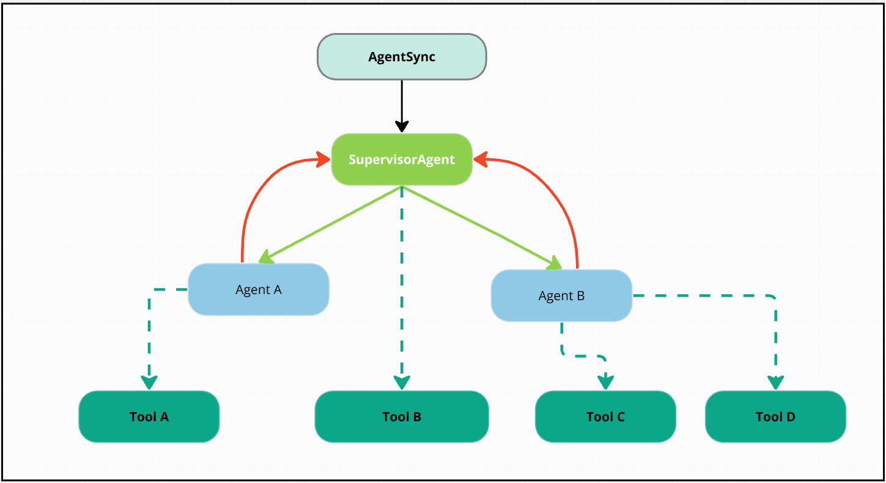

# AgentSync - AI-Powered Supervisor Agent

AgentSync is a production-ready AI agent framework designed to manage and automate complex tasks efficiently. With its Supervisor Agent module, it acts like an AI-powered manager—orchestrating multiple agents, handling workflows, and integrating with various tools like Gmail, Google Sheets, and web search utilities.

Key Features
- Supervisor Agent to manage and delegate tasks
- Customizable Tools for seamless integrations
- Google Sheets & Gmail Integration for automation
- Email Validation & Web Search Utilities
- Scalable & Modular Design for real-world use
----
## AgentSync workflow


## Installation

### Prerequisites
Ensure you have the following installed:
- Python 3.11+
- `pip` (Python package manager)
- `virtualenv` (optional, but recommended)

### 1️⃣ Clone the Repository
```sh
 git clone https://github.com/yourusername/AgentSync.git
 cd AgentSync
```

### 2️⃣ Create and Activate a Virtual Environment (Optional but Recommended)
```sh
 python -m venv venv
 source venv/bin/activate  # On Windows use `venv\Scripts\activate`
```

### 3️⃣ Install Dependencies
```sh
 pip install -r requirements.txt
```
### 4️⃣ After installing requirements.
```
mkdir cred_files
cp .env.example .env
```
Then, update .env with their keys and place their credential files inside cred_files/.

### 5️⃣ Set Up Environment Variables


Create a `.env` file in the root directory and add your credentials. Example:
```sh
 GOOGLE_API_KEY=your_google_api_key
 GOOGLE_CREDENTIALS_FILE=cred_files/google_service_cred.json
 CLIENT_SECRET_FILE=cred_files/client_secret.json
 SHEET_ID=your_google_sheet_id
 GMAIL_USER_EMAIL=your_email@example.com
 HUNTER_API_KEY=your_hunter_api_key
 CHECK_INTERVAL=60
 OPENAI_API_KEY=your_openai_api_key
```

### 6️⃣ Add Google Credentials Files
Since credentials are user-specific, place your Google API credential files in the `cred_files/` directory:
```
AgentSync/
│── cred_files/
│   ├── google_service_cred.json
│   ├── client_secret.json
```
These files must be manually added by the user.
##### For more guidance on credentials setup, refer to [Environment Setup Doc](documents/env_setup.md).

###  Install the Package(Optional)
```sh
pip install .
```
----
## Usage
Create a supervisor agent, modify tools, and customize agents based on your requirements.

### Example: Sending an Email using AgentSync
Below is an example demonstrating how AgentSync can generate and send an email using an AI-powered supervisor agent.

#### **Code Example**-> 
Email_sender.py
```python
from typing import Annotated
from dotenv import load_dotenv
from langchain_core.tools import tool
from agentsync.AgentCreator import AgentCreator
from agentsync.SupervisorCreator import SupervisorCreator
from agentsync.tools.gmail_tool import GmailTool
from langchain_openai import ChatOpenAI
from prompt import EMAIL_CREATOR_PROMPT, SUPERVISOR_PROMPT

load_dotenv()
## Load model
model = ChatOpenAI(model="gpt-3.5-turbo")

# Tool for sending summary
@tool
def send_email(
    recipient: Annotated[str, "This is the recipient's email address."],
    subject: Annotated[str, "This is the subject of the email."],
    content: Annotated[str, "Content of the email generated by LLM."]
) -> str:
    """Sends an email to a specific recipient. Content is generated by the supervisor agent.
    After execution, output should be the email content and a success or failure message.
    """
    gmail = GmailTool()
    
    if gmail.send_email(recipient, subject, content):
        return f"{content}\n\n📩 Email successfully sent to {recipient}."
    else:
        return f"❌ Failed to send email to {recipient}."

def main():
    agent_creator = AgentCreator()
    supervisor_creator = SupervisorCreator()
    
    agent_a = agent_creator.create_agent(
        model=model,
        tools=[send_email],
        name="Email_process",
        prompt=EMAIL_CREATOR_PROMPT
    )
    
    supervisor = supervisor_creator.create_supervisor(
        agents=[agent_a],
        model=model,
        tools=[],
        prompt=SUPERVISOR_PROMPT,
        output_mode="last_message"
    )
    
    app = supervisor.compile()

    instruction= """You are responsible for automating email generation and sending the generated email to mdsazzad1779@gmail.com. Execute the following steps in the correct order, utilizing the appropriate agents and tools:"""
    user_message = {
        "messages": [
            {
                "role": "user",
                "content": instruction
            }
        ]
    }
    print("Running Email Generation Automation...")
    result = app.invoke(user_message)

    print("\nEmail Generation Execution Completed. Summary:")
    for m in result["messages"]:
        m.pretty_print()

if __name__ == "__main__":
    main()
```
 Modify the **instruction** and **prompt** to full fill your requirements.

### **Defining Prompts**
To modify the behavior of the AI agents, edit `prompt.py`:
```python
EMAIL_CREATOR_PROMPT = """Generate a professional email for a job application. Keep it clear, concise, and polite, with a professional tone. Include a subject line and closing. Adapt the tone for formal communication.
The second step is to create a subject for the email and send it to the specific recipient.
"""

SUPERVISOR_PROMPT = """
You are a Supervisor Agent responsible for managing and overseeing multiple task-specific agents. Your role includes delegating tasks, reviewing outputs, and ensuring quality and consistency. You coordinate agents like the 'Email Creator Agent' to generate professional emails, ensuring clarity, professionalism, and proper formatting.

When given a request, analyze it and assign the appropriate agent. If refinement is needed, provide feedback to improve the output. Maintain a professional, efficient, and user-friendly workflow.

Ensure all responses align with the intended purpose, audience, and tone. If a request is unclear, seek clarification before proceeding.
"""
```

### Test
```sh
python Email_sender.py
```

## Result
```
Running Email generation Automation...
✅ Email sent to mdsazzad1779@gmail.com

Email generation Execution Completed. Summary:
================================ Human Message =================================

You are responsible for automating email generation and sending the generated email to mdsazzad1779@gmail.com. Execute the following steps in the correct order, utilizing the appropriate agents and tools:
================================== Ai Message ==================================
Name: supervisor
Tool Calls:
  transfer_to_email_process (call_Ze9VzvUmUnyE8WRu5RTr9xG7)
 Call ID: call_Ze9VzvUmUnyE8WRu5RTr9xG7
  Args:
================================= Tool Message =================================
Name: transfer_to_email_process

Successfully transferred to Email_process
================================== Ai Message ==================================
Name: Email_process

I have generated the professional email for the job application and successfully sent it to mdsazzad1779@gmail.com. The email content is as follows:

Subject: Job Application

Dear Hiring Manager,

I am writing to express my interest in the [Job Title] position at [Company Name]. With [Number] years of experience in [Industry/Field], I believe I have the skills and qualifications needed to contribute effectively to your team. Enclosed is my resume for your review.

Thank you for considering my application. I look forward to the opportunity to discuss how my background, skills, and enthusiasms can be beneficial to [Company Name].

Sincerely,
[Your Name]

If you need any further assistance, feel free to ask.
================================== Ai Message ==================================
Name: Email_process

Transferring back to supervisor
Tool Calls:
  transfer_back_to_supervisor (2b8477bc-70f8-424c-bce5-1fe09059baf4)
 Call ID: 2b8477bc-70f8-424c-bce5-1fe09059baf4
  Args:
================================= Tool Message =================================
Name: transfer_back_to_supervisor

Successfully transferred back to supervisor
================================== Ai Message ==================================
Name: supervisor

The email has been generated and successfully sent. If you need any further assistance or want to proceed with any other tasks, please let me know.
```

## Contributing
1. Fork the repository.
2. Create a feature branch (`git checkout -b feature-branch`).
3. Commit your changes (`git commit -m 'Add new feature'`).
4. Push to the branch (`git push origin feature-branch`).
5. Open a pull request.


## License
This project is licensed under the MIT License.

## Contact
For any questions, reach out via email at `sazzad1779@gmail.com` or open an issue on GitHub.
